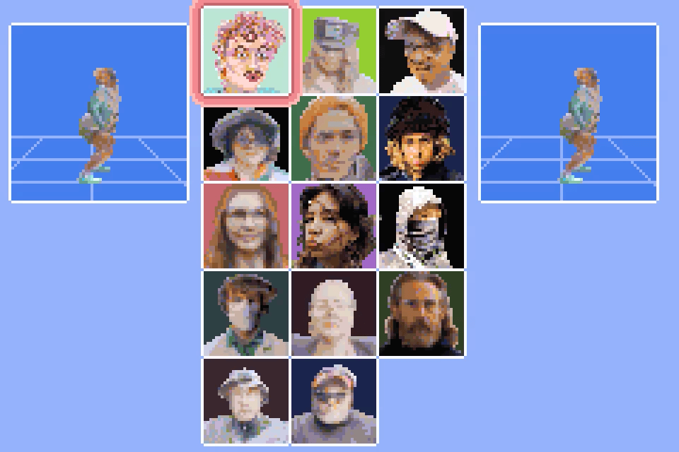

# Boomhut Brawl

CCU Heidag 2024

## Instructions for building 

Built using [butano](https://github.com/GValiente/butano), follow the [setup instructions](https://gvaliente.github.io/butano/getting_started.html) in their documentation.

Graphics made with [Polycam](https://poly.cam/),  [Blender](https://www.blender.org/) and  [Aseprite](https://www.aseprite.org/).